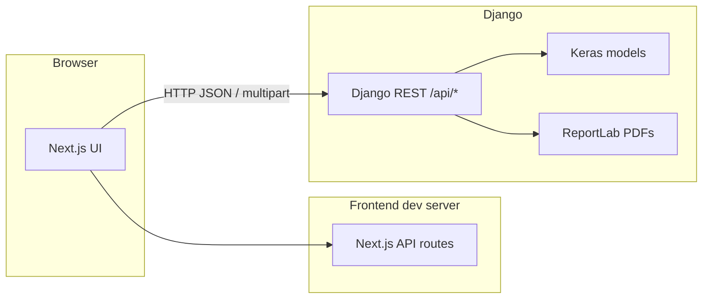

# Food App — AI-assisted food & freshness analysis

Full-stack application that combines a **Django REST** backend (TensorFlow / Keras models, optional USDA nutrition enrichment) with a **Next.js** frontend (React 19, Tailwind CSS, Radix UI). Users can analyze food images for classification and freshness, explore health-oriented UI flows, and download structured reports.

**Repository:** [https://github.com/PrasanthS2104/Food_App](https://github.com/PrasanthS2104/Food_App)

---

## Table of contents

1. [Overview](#1-overview)
2. [Highlights](#2-highlights)
3. [System architecture](#3-system-architecture)
4. [Technology stack](#4-technology-stack)
5. [Repository layout](#5-repository-layout)
6. [Prerequisites](#6-prerequisites)
7. [Getting started](#7-getting-started)
   - [7.1 Backend (Django)](#71-backend-django)
   - [7.2 Frontend (Next.js)](#72-frontend-nextjs)
   - [7.3 Running both services](#73-running-both-services)
8. [Configuration](#8-configuration)
9. [REST API](#9-rest-api)
10. [Machine learning assets](#10-machine-learning-assets)
11. [Security & privacy](#11-security--privacy)
12. [Troubleshooting](#12-troubleshooting)
13. [Contributing & license](#13-contributing--license)

---

## 1. Overview

| Layer | Role |
|--------|------|
| **Frontend** | Next.js app: landing, scanners, health insights, charts, and API routes that can orchestrate analysis flows. |
| **Backend** | Django + DRF: image upload, inference via Keras models, PDF report generation, CORS-enabled API for the SPA. |
| **ML** | Pre-trained `.keras` models for fruit/food classification and fresh vs. rotten estimation (paths resolved relative to `Backend/`). |

The project is organized as a **monorepo**: `Backend/` and `Frontend/` share one Git history so API contracts and releases stay aligned.

---

## 2. Highlights

### 2.1 User-facing

- Image-based food and freshness workflows with a modern, component-driven UI.
- Health-oriented visualizations (timelines, meters, explainability-style panels).
- Optional integration patterns for label and image analysis (see `Frontend/app/api/*`).

### 2.2 Engineering

- **REST API** under `/api/` for prediction and reporting.
- **Media uploads** stored under `Backend/media/` (ignored by Git; recreated locally).
- **SQLite** for development (`db.sqlite3` ignored by Git).
- **CORS** enabled for local full-stack development (`CORS_ALLOW_ALL_ORIGINS` in dev — tighten for production).

---

## 3. System architecture



**Data flow (typical):**

1. User selects or captures an image in the frontend.
2. Frontend sends the image to Django endpoints (`/api/predict/`, `/api/predict_food/`, etc.).
3. Backend preprocesses the image, runs the appropriate model, and returns structured JSON.
4. User may request a PDF via `/api/download-report/`.

---

## 4. Technology stack

| Area | Technologies |
|------|----------------|
| **Backend** | Python 3.x, Django 5.2, Django REST Framework, django-cors-headers, Gunicorn |
| **ML** | TensorFlow 2.19, Keras, NumPy, OpenCV, Pillow |
| **Reports** | ReportLab |
| **Frontend** | Next.js 16, React 19, TypeScript, Tailwind CSS 4, Radix UI, Framer Motion, Recharts |
| **Config** | python-dotenv (backend), `.env` for secrets (not committed) |

---

## 5. Repository layout

```
Food_App/
├── README.md                 # This file
├── requirements.txt          # Python dependencies (backend)
├── images/                   # Sample / marketing images (tracked)
├── Backend/
│   ├── fruitapi/             # Django project (settings, root URLs)
│   ├── predictor/            # App: views, URLs, prediction logic
│   ├── models/               # Class index JSON, auxiliary assets
│   ├── media/                # Uploaded files (gitignored)
│   ├── manage.py
│   └── *.keras               # Trained model weights (large binaries)
└── Frontend/
    ├── app/                  # Next.js App Router pages & API routes
    ├── components/           # UI + feature components
    ├── public/               # Static assets
    ├── package.json
    └── ...
```

Root `.gitignore` excludes virtualenvs, `node_modules`, `.next`, `.env`, SQLite DB, and `Backend/media/` so clones stay safe and smaller.

---

## 6. Prerequisites

- **Python** 3.10+ (3.11 recommended for TensorFlow wheels).
- **Node.js** 20+ (LTS) and **npm**, **pnpm**, or **yarn** (lockfiles present for npm/pnpm).
- **Git** and enough disk space for **Keras model files** (hundreds of MB total).
- Optional: **USDA FoodData Central API key** for nutrition enrichment (`USDA_API_KEY` in `.env`).

---

## 7. Getting started

### 7.1 Backend (Django)

From the **repository root**:

```powershell
cd Backend
python -m venv venv
.\venv\Scripts\activate
pip install -r ..\requirements.txt
```

Create `Backend/.env` (see [Configuration](#8-configuration)), then:

```powershell
python manage.py migrate
python manage.py runserver
```

The API base URL for local development is typically: `http://127.0.0.1:8000/`.

### 7.2 Frontend (Next.js)

```powershell
cd Frontend
npm install
npm run dev
```

Default dev URL: `http://localhost:3000`.

> **Note:** Some components call the backend at `http://127.0.0.1:8000`. For deployment, replace hardcoded URLs with environment-based configuration (e.g. `NEXT_PUBLIC_API_URL`).

### 7.3 Running both services

1. Start Django on port **8000**.
2. Start Next.js on port **3000**.
3. Use the UI in the browser; ensure firewall/OS allows localhost loopback between the two ports.

---

## 8. Configuration

### 8.1 Backend environment (`Backend/.env`)

| Variable | Purpose |
|----------|---------|
| `USDA_API_KEY` | Optional. Used when enabling USDA FoodData Central lookups for nutrition data. |

Never commit real API keys. Rotate any key that was ever committed to history.

### 8.2 Django settings (development vs production)

- `DEBUG = True` and empty `ALLOWED_HOSTS` are suitable **only** for local work.
- For production: set `DEBUG = False`, configure `ALLOWED_HOSTS`, use a strong `SECRET_KEY` from environment variables, restrict `CORS_ALLOWED_ORIGINS`, and serve behind HTTPS.

---

## 9. REST API

Base path: **`/api/`** (included from the Django root URLconf).

| Method | Path | Description |
|--------|------|-------------|
| *as implemented* | `/api/predict/` | Fruit / freshness-oriented prediction endpoint (see `predictor.views`). |
| *as implemented* | `/api/predict_food/` | Food classification-oriented endpoint. |
| *as implemented* | `/api/download-report/` | Generates/downloads a PDF report for a completed analysis flow. |

Exact request/response shapes are defined in `Backend/predictor/views.py`. Prefer reading that file when integrating new clients.

**Admin:** `http://127.0.0.1:8000/admin/` (create a superuser with `python manage.py createsuperuser` if needed).

---

## 10. Machine learning assets

Tracked under `Backend/`:

- **`fruit_model.keras`**, **`fresh_model.keras`** — fruit and freshness-related inference.
- **`food_model.keras`**, **`food_model1.keras`**, **`food_model1_fixed.keras`** — food classification variants.
- **`models/classes.json`**, **`models/food_class_indices.json`** — label ↔ index mappings.

Cloning this repository downloads large binaries; use a stable connection or shallow clone only if you accept missing history for those blobs.

Utility script: `Backend/fix_model.py` (model repair / migration helper — run only when you understand its effect on your weights).

---

## 11. Security & privacy

- **Secrets:** Keep `.env` out of version control; the repo’s `.gitignore` enforces this for standard layouts.
- **Uploaded images:** `Backend/media/` is gitignored; treat uploads as user data and protect accordingly in production.
- **CORS:** Current settings are permissive for development; lock down origins before any public deployment.
- **Dependencies:** Periodically run `pip list --outdated` and `npm audit` and apply patches.

---

## 12. Troubleshooting

| Symptom | Things to check |
|---------|------------------|
| `ModuleNotFoundError` (e.g. `corsheaders`, `dotenv`) | Activate the venv and `pip install -r requirements.txt` from the repo root. |
| TensorFlow install fails | Match Python version to a [supported TF release](https://www.tensorflow.org/install); use 64-bit Python. |
| Frontend cannot reach API | Confirm Django is on `127.0.0.1:8000` and URLs in components match your environment. |
| Large Git clone | Expected due to `.keras` files; use good connectivity or Git partial clone strategies if needed. |

---

## 13. Contributing & license

Issues and pull requests are welcome against [PrasanthS2104/Food_App](https://github.com/PrasanthS2104/Food_App).

If you do not specify a license in the repository, default copyright applies; consider adding a `LICENSE` file (e.g. MIT, Apache-2.0) to clarify reuse.

---

**Author:** Prasanth — project maintained for learning and portfolio use. Update this section if you formalize ownership or a team.
